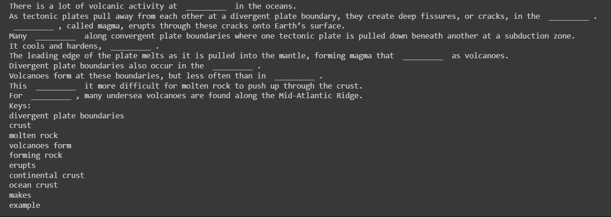
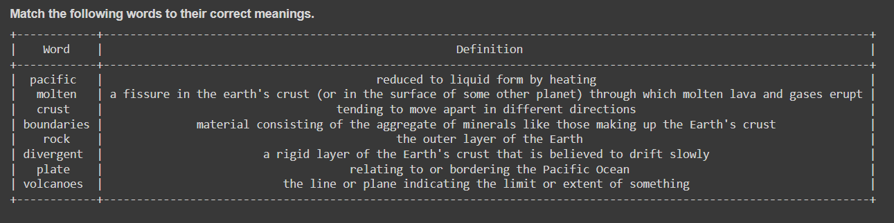
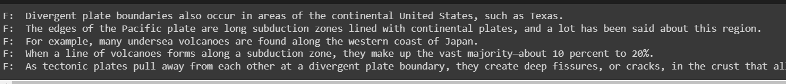
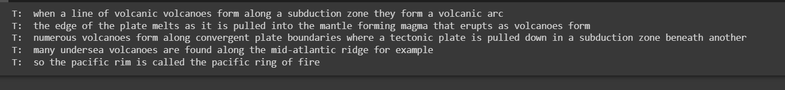

# QuestionAnswerGeneration

The goal of the project is to develop a tool that can rapidly generate a wide variety of questions for a given paragraph. It can be very useful in generating chapter end questions for students. It would lighten the stress on teachers and students by enabling them to quickly develop worksheets for each individual chapter. The system will be able to provide a variety of questions, including Fill in the Blanks, True/False, Match the Following  and Short Summary of the given text.

<<<<<<< HEAD
#Dataset

The Stanford Question Answering Dataset (SQuAD) is a popular benchmark dataset for machine comprehension tasks. It was created by researchers at Stanford University and consists of over 100,000 question-answer pairs, which are derived from a set of Wikipedia articles. Each question is associated with a specific context paragraph that contains the information necessary to answer the question. The SQuAD dataset was created by a team of researchers at Stanford University led by Pranav Rajpurkar and Percy Liang. The team selected a set of Wikipedia articles across a variety of topics and then used a crowd-sourcing platform to collect question-answer pairs based on the content of those articles. 

#Sentence Constituency Parsing

Sentence constituency parsing is a method for analyzing natural language that requires dividing a sentence into its component clauses and phrases. Constituency parsing aims to recognise the grammatical connections between words in a phrase and express them in a parse tree, which is a tree-like structure.
=======

# Sample Result

Suppose for the given sample paragraph: 

*“There is a lot of volcanic activity at divergent plate boundaries in the oceans. For example, many undersea volcanoes are found along the Mid-Atlantic Ridge. This is a divergent plate boundary that runs north-south through the middle of the Atlantic Ocean. As tectonic plates pull away from each other at a divergent plate boundary, they create deep fissures, or cracks, in the crust. Molten rock, called magma, erupts through these cracks onto Earth’s surface. At the surface, the molten rock is called lava. It cools and hardens, forming rock. Divergent plate boundaries also occur in the continental crust. Volcanoes form at these boundaries, but less often than in ocean crust. That’s because continental crust is thicker than oceanic crust. This makes it more difficult for molten rock to push up through the crust. Many volcanoes form along convergent plate boundaries where one tectonic plate is pulled down beneath another at a subduction zone. The leading edge of the plate melts as it is pulled into the mantle, forming magma that erupts as volcanoes. When a line of volcanoes forms along a subduction zone, they make up a volcanic arc. The edges of the Pacific plate are long subduction zones lined with volcanoes. This is why the Pacific rim is called the “Pacific Ring of Fire.”*

The different types of questions answers generated are as follows:

Fill in the Blanks

Match The Following
                         

True False

Summary

*“Tectonic plates pull away from each other at a divergent plate boundary. Molten rock erupts through these fissures on earth’s surface forming rock.
Divergent plates also occur in the continental crust, but less often than oceanic crust - which makes it more difficult for lava to push up through
the crust.”*
>>>>>>> 4543f59b29496dbfd52068ae9da6d373ee66c6e1
